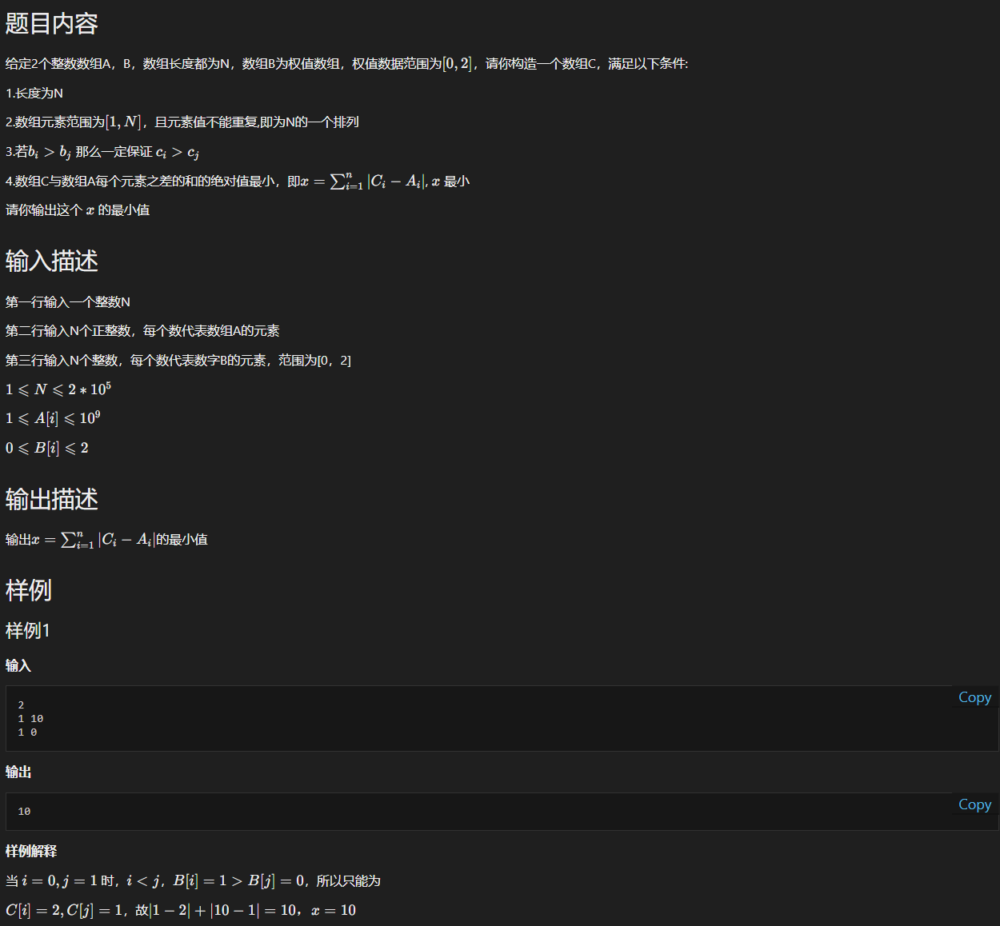

# yy-腾讯-2023.03.26-第四题-构造最小值数组


## 题目描述




## 核心知识点

贪心算法


## 思路

由于数组 C 的特性（第二点和第三点） 以及数组 B 的特性 （0 1 2），因此也能把数组 C 分为三段：（假设数组 B 中 0 的元素个数是 `cnt_zero` ，1 的元素个数是 `cnt_one`， 2 的元素个数是 `cnt_two ` ）：

* `[1 ~ cnt_zero]`
* `[cnt_zero + 1, cnt_zero + cnt_one]`
* `[cnt_zero + cnt_one + 1, cnt_zero + cnt_one + cnt_two]`     (`cnt_zero + cnt_one + cnt_two = N`)


因此关注的重点就是如何满足数组 C 的第四点要求，也就是在上述的每一段中，如何选择排列方式。  猜测：与数组 A 中的元素大小的顺序一致进行排布，可得到绝对值最小。

证明：以最简单的情况， 假设 A 只有两个元素， `A = [a, b]` ，那么 C 也只含有 1 和 2 两个元素，因此 C 要么 `C = [1 2]` ，要么 ` C = [2 1]` ，可以通过画图 / 或者分类讨论等方式得出 C 的顺序与 A 的顺序一致时，可得到绝对值差最小。 （数学归纳法）


## 代码

```c++
#include <iostream>
#include <algorithm>
#include <cmath>
using namespace std;

// 在堆中分配，效率最快 0.8MB * 4 = 3.2MB (可接受) 
// 因为 N 最大是200000, 所以设置 200005
int A[200005];
int zero[200005], cnt_zero;  // 记录 B 中值为 0 的下标
int one[200005], cnt_one;    // 记录 B 中值为 1 的下标
int two[200005], cnt_two;    // 记录 B 中值为 2 的下标
int N;

int main() {
    cin >> N;
    ios::sync_with_stdio(false); // 加快输入
    for (int i = 0; i < N; ++i) {
        cin >> A[i];
    }
    
    int val;
    for (int i = 0; i < N; ++i) {
        cin >> val;
        if (val == 0) {
            zero[cnt_zero++] = i; 
        } else if (val == 1) {
            one[cnt_one++] = i;
        } else {
            two[cnt_two++] = i;
        }
    }
    
    long long res = 0; // 考虑最坏情况: 10^9 * 10^5 = 10 ^ 14 (大约是 2 ^ 40 ~ 2 ^ 50) (因此采用int64处理)
    // 根据 A[idx] 的顺序对下标进行排序
    sort(zero, zero + cnt_zero, [](const int &lhs, const int &rhs) {
        return A[lhs] < A[rhs];
    });
    sort(one, one + cnt_one, [](const int &lhs, const int &rhs) {
        return A[lhs] < A[rhs];
    });
    sort(two, two + cnt_two, [](const int &lhs, const int &rhs) {
        return A[lhs] < A[rhs];
    });

    int cnt = 1;
    for (int i = 0; i < cnt_zero; ++i) {
        res += abs(A[zero[i]] - cnt++);
    }
    for (int i = 0; i < cnt_one; ++i) {
        res += abs(A[one[i]] - cnt++);
    }
    for (int i = 0; i < cnt_two; ++i) {
        res += abs(A[two[i]] - cnt++);
    }

    cout << res << "\n";
    return 0;
}
```

* 时间：$O(NlogN)$
* 空间：$O(N)$