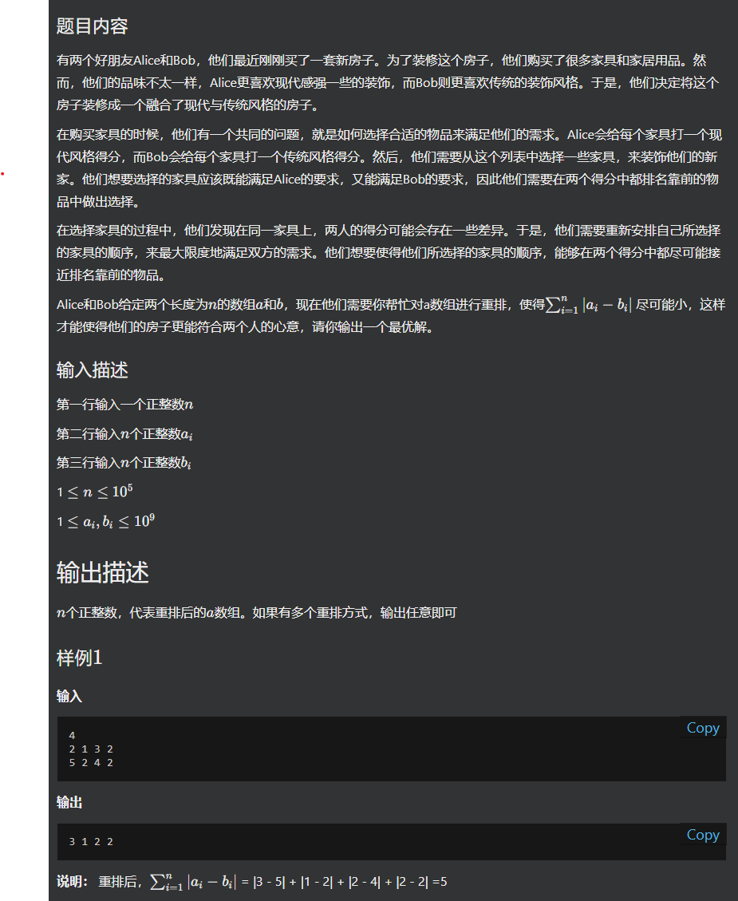
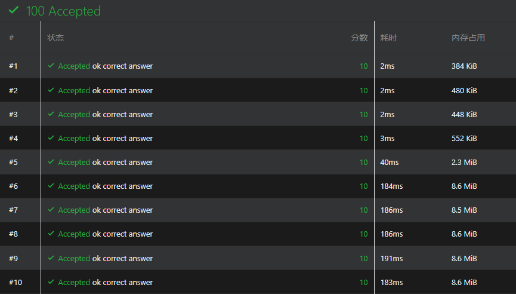

# yy-阿里-2023.03.21-第一题-数组重排





算法解决思路：当重排后 a 数组中元素的相对顺序和 b 数组中元素的相对顺序一致时，即可得到差值最小。（这个规律在腾讯的 2023.03.26-第四题-构造最小值数组 也出现过）


在这里主要记录下时间复杂度：10W 的数据，两次 $O(NlogN)$ 的操作，差不多单次执行 180 - 190 ms ，通过全部数据就是 1s ，大概就是勉强能过的水平。（大概的评估基准）（**在机试的时候，时间限制是所有问题求解的累积时间**）




```c++
#include <iostream>
#include <algorithm>
#include <vector>
#include <map>
using namespace std;

int n;
int a[100005];
multimap<int,int> m_b;
int res[100005];

int main() {
    ios::sync_with_stdio(false);
    cin >> n;
    for (int i = 0; i < n; ++i) {
        cin >> a[i];
    }
    for (int i = 0; i < n; ++i) {
        int t;
        cin >> t;
        m_b.insert(make_pair(t, i));
    }
    sort(a, a + n);
    
    int cnt = 0;
    for (auto ite = m_b.begin(); ite != m_b.end(); ite++) {
        res[ite->second] = a[cnt++];
    }

    for (int i = 0; i < n; ++i) {
        cout << res[i] << " ";
    }
    cout << "\n";
    return 0;
}
```

