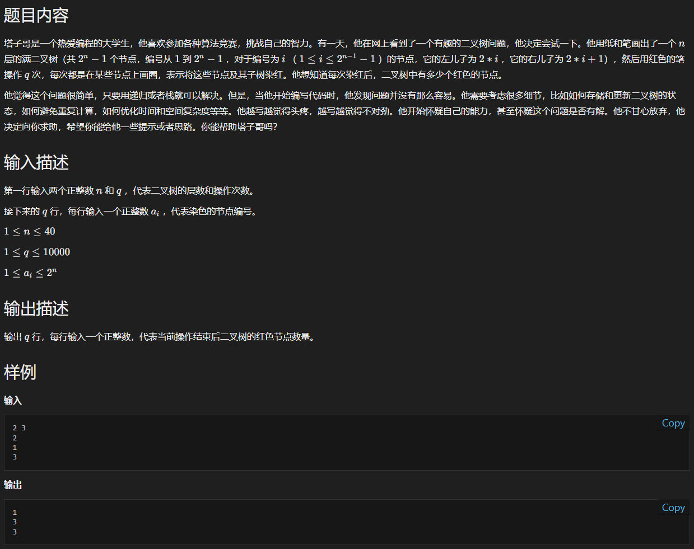

# yy-阿里-2023.03.21-第三题-二叉树的染色





## 核心知识点

树的操作 / 满二叉树的理解


## 题目分析

首先要对满二叉树的形状和数量关系有着清晰的认识。


对每个节点染红有如下情况：

* 该节点已经被染红（也就是说，自身 / 祖先节点已经被染红过），那么此时直接输出个数即可
* 该节点未被染红，那么需要结合子树已经被染红的情况，更新个数


那么关键在于：需要哪些状态才能知道祖先节点已经被染红 / 子树被染红的情况 ？

这时候就需要利用满二叉树的特性：对于 `idx = 8` 这个节点

1. 其祖先节点就是：`4 2 1` ，一直除 2 。 
2. 其子节点就是：`16 17` ，继续就是 `32 33` `34 35` ，递归地查询。

因此，只需要通过一个哈希表存储已经被染红的子树的根节点即可。（保存了树的结构：被染红 / 没被染红）

> 由于 n 最大为 40 ，因此不可能将树的所有节点表示出来， $2^{40}$ 太大； 根节点染色，那么子节点一定被染色，通过该关系进行压缩。


在上面的基础上，增加层数信息 + 已经染红的节点个数即可计算个数信息。


## 算法逻辑

```c++
std::unordered_set<LL> visited_root; // 存储已经被染红的子树的根节点
LL cnt_red = 0; // 存储已染红的节点个数
```

* 如果一个节点 idx ：
  * 递归向上查找祖先节点已经在 `visited_root` 中，那么相当于不需染色
  * 否则递归向下更新染色后的数的状态和个数：
    * 如果子树节点被染色时，需要根据个数关系，减去该子树节点的个数（已经被染色过）
    * 否则继续递归向下


## 代码

由于树的递归特性：所以函数的实现大多都是基于递归写的，比较方便。

```c++
#include <iostream>
#include <unordered_set>
#include <algorithm>
#include <cmath>
using namespace std;

int n; 
int q;
using LL = long long;
std::unordered_set<LL> visited_root; // 存储已经被染红的子树的根节点
LL cnt_red = 0; // 存储已染红的节点个数

// 判断该节点自身以及祖先节点是否已经被染红
bool isVisited(LL idx) {
	if (idx == 0) 
		return false;
	if (visited_root.find(idx) != visited_root.end())
		return true;
	return isVisited(idx >> 1);
}

// 对以idx为root的子树进行调整, level 表示 idx 的层级, cnt 表示新增的染红节点个数
void adjustDown(LL idx, int level, LL &cnt) {
	if (level > n)
		return;
	
	auto it = visited_root.find(idx);
	if (it == visited_root.end()) {
		adjustDown(idx << 1, level + 1 , cnt);
		adjustDown((idx << 1) + 1, level + 1 , cnt);
	} else {
		// 个数维护
		int cnt_sub_tree = LL(pow(2, n - level + 1)) - 1;
		cnt -= cnt_sub_tree;

		// 树结构维护(其实这个可有可无，不影响结果)
		visited_root.erase(it);
	}
}

int getLevel(LL idx) {
	if (idx == 1) {
		return 1;
	} else {
		return getLevel(idx >> 1) + 1;
	}
}

int main() {
	cin.tie(NULL); 
	ios::sync_with_stdio(false); 
	cout.tie(NULL);
    
	cin >> n >> q;
	for (int i = 0; i < q; ++i) {
		LL ai;
		cin >> ai;
		if (isVisited(ai)) {
			cout << cnt_red << "\n";
		} else {
			// 考虑更新染红状态和个数
			int level = getLevel(ai);
			LL cnt = LL(pow(2, n - level + 1)) - 1;
			
			adjustDown(ai, level, cnt);
			cnt_red += cnt;

			visited_root.insert(ai);
			cout << cnt_red << "\n";
		}
		
	}
	return 0;
}
```

