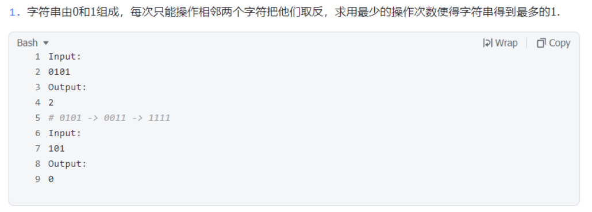

# yy-阿里-2023.03.21-第二题-最大化01串中1的个数


## 题目描述




## 核心知识点

模拟， 前 / 后缀和优化


## 题目分析

根据题意，可以知道：

* 如果有奇数个 0，那么会剩下一个 0
* 如果有奇数个 0，那么不会剩下一个 0 


（之前的错误思路）之前想过通过四种模式进行处理，用 `00 01 10 11` 进行判断计算最少的操作次数，后来发现缺少一些考量。

* 对于测试数据：`0011111111111011111111111100` ，需要将中间的 0 剩下，只需要 2 次操作；  然而使用上面这种方式，只会顺序处理：
  * 如果相当于将第一个和第二个合并，第三个和第四个合并，依次类推。并没有考虑到中间元素剩下的情况。


**可以将问题换一种表述形式：每个 0 只能用一次，使所有 0 所在的下标差值之和最小。**

比如：

*  0101，第一个 0 的下标是 0，第一个 0 的下标是 2，因此要把这两个 0 消去，最小操作数 = 2 - 0（下标之差）
* 010111110：最小操作数 = 2 - 0 ，剩下最后一个元素

更加精确一点：

* 如果有偶数个 0 ，那么很容易想到顺序处理，第二个 0 的下标 - 第一个 0 的下标  + 第四个 0 的下标 - 第三个 0 的下标 + ........
* 如果有奇数个 0，需要去除一个 0 元素，使其他的所有 0 所在的下标差值之和最小。 （转换为偶数问题）


因此：首先给出解 1（下面代码）
一般来讲：$O(n^2)$ 对于这种题目基本上是超时的。所以需要优化：对于偶数的情况，如何利用空间换取时间，来减少重复的计算量。


优化思路：

* 对于记录 0 元素的下标 `v` ： 由于其个数是奇数，进行这样的划分，对于偶数下标 `idx` ，让 `v[0] ~ v[idx-1]` 有偶数个元素 ， 同样 `v[idx+1] ~ v[v.size() - 1]` 也有偶数个元素。（对每个偶数下标进行一种划分，计算两端偶数个数数组的差值之和，两端和就是前缀和和后缀和） 
* 因此，核心就在于记录前缀和和后缀和。
* 因此，给出解法 2


## 题目代码

```c++
// 解1

#include<iostream>
#include<vector>
using namespace std;


int main() {
        string str;
        cin >> str;

        vector<int> v;  // 记录 0 元素的下标

        for (int i = 0; i < str.size(); ++i) {
                if (str[i] == '0') {
                        v.push_back(i);
                }
        }

        int res = 0; // 最小操作数
    	// 偶数情况
        if (v.size() % 2 == 0) {
                for (int i = 0; i < v.size(); i = i + 2) {
                        res += (v[i+1] - v[i]);
                }
        // 奇数
        } else {
                res = 0x3f3f3f3f;
            	// idx: 不考虑 v[idx] 这个 0 元素的下标 
                for (int idx = 0; idx < v.size(); ++idx) {
                        int l = 0, r = 1, sum = 0; // l, r 双指针 ;   sum: 本轮的操作数
                        while (l < v.size()) {
                                if (l == idx) {
                                        ++l;
                                        r = l + 1;
                                } else if (r == idx) {
                                        ++r;
                                } else {
                                        sum += v[r] - v[l];
                                        l = r + 1;
                                        r = l + 1;
                                }
                        }
                        res = min(res, sum);
                }
        }

        cout << res << endl;
        return 0;
}
```

* 时间：$O(n^2)$
* 空间：$O(n)$


```c++
#include<iostream>
#include<vector>
using namespace std;


int main() {
        string str;
        cin >> str;

        vector<int> v; // 记录 0 的下标

        for (int i = 0; i < str.size(); ++i) {
                if (str[i] == '0') {
                        v.push_back(i);
                }
        }

        int res = 0;
        if (v.size() % 2 == 0) {
                for (int i = 0; i < v.size(); i = i + 2) {
                        res += (v[i+1] - v[i]);
                }
        } else {
				int sz = v.size(); // sz: 奇数
				vector<int> suffix(sz+1, 0);  // 记录后缀和, 多分配一个位置  suffix[sz] 作为空置
				
            	 // 生成后缀和
				for (int i = sz - 2; i >= 0; i -= 2) {
					suffix[i] = suffix[i+2] + (v[i+1] - v[i]);
				}

				res = 0x3f3f3f3f;
				int pre = 0; // 前缀和
            	// 划分为  [0~i-1]  [i+1~size] 两个偶数长度 
				for (int i = 0; i <= sz; i += 2) {
					res = min(res, pre + suffix[i+1]);
					pre += (v[i+1] - v[i]);
				}
        }

        cout << res << endl;
        return 0;
}
```

* 时间：$O(n)$
* 空间：$O(n)$


## 关于测试数据的设计

* 奇数 0 / 偶数 0
* 奇数 0 ：
  * 不考虑的 0 不是第一个或者最后一个 / 在中间位置


## 其他问题（可以提问）

