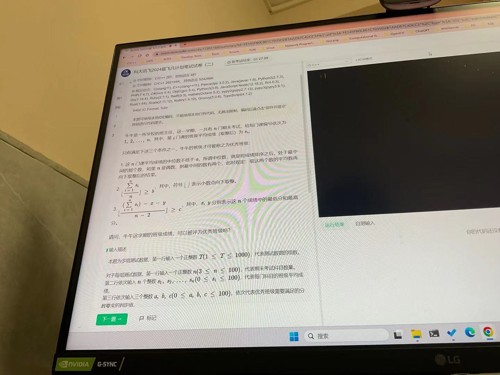
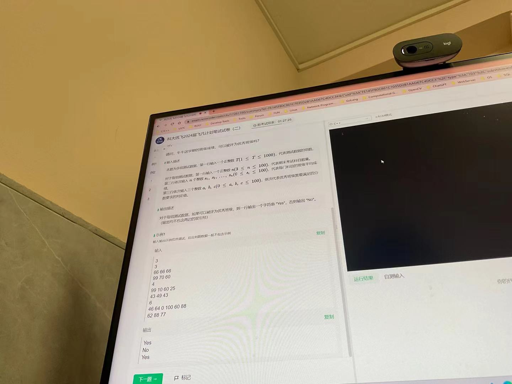
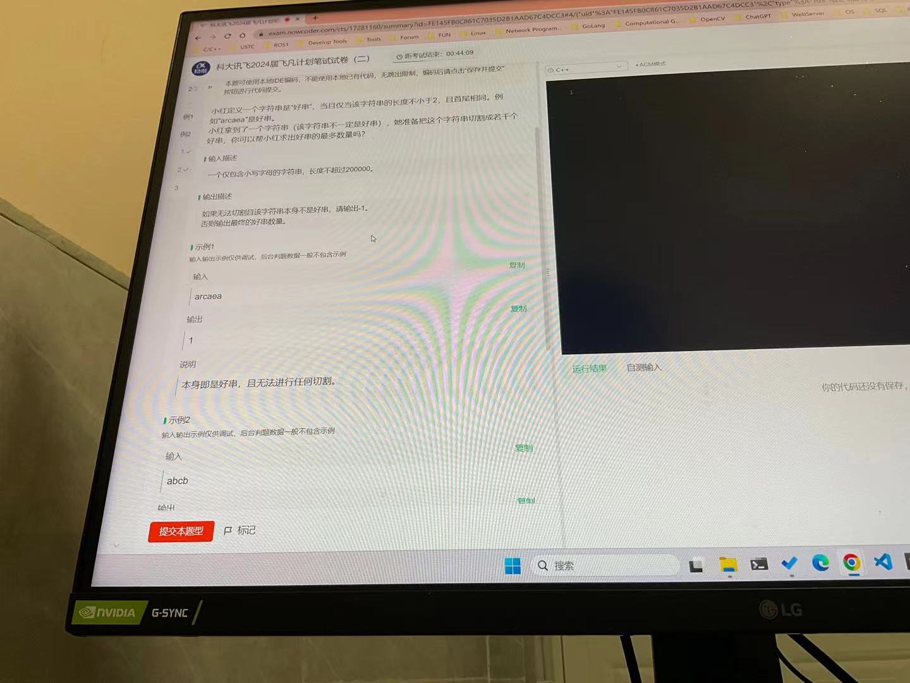

# Notes


## 第一题






简单模拟题

```c++
#include <iostream>
#include <vector>
#include <algorithm>
using namespace std;

int T;
int n; // 考试科目
int s[105]; // 考试科目成绩 
int a, b, c;


int main() {
	cin.tie(nullptr);
	ios::sync_with_stdio(false);

	cin >> T;
	while (T--) {
		cin >> n;
		int sum = 0; // 成绩之和
		for (int i = 0; i < n; ++i) {
			cin >> s[i];
			sum += s[i];
		}
		cin >> a >> b >> c;
		
         // 排序处理(得到最高分和最低分)
		sort(s, s + n);

		int m = n % 2 == 1 ? s[n / 2] : (s[n / 2 - 1] + s[n / 2]) / 2; // 计算中位数

		if (m >= a) {
			cout << "Yes" << endl;
			continue;
		}

		if (sum / n >= b) {
			cout << "Yes" << endl;
			continue;
		}
		
         // 去掉最高分和最低分
		if ((sum - s[0] - s[n - 1]) / (n - 2) >= c) {
			cout << "Yes" << endl;
			continue;
		}

		cout << "No" << endl;
	}

	return 0;
}
```


## 第二题


关键在于明确题目的含义，在这里，我们使用最简单的遍历方式：逐层遍历每一行元素，第一行从左往右，第二行从右往左。（在这个代码中，向下为 x 正方向，向右为 y 正方向）

```c++
#include <iostream>
using namespace std;

int n, m;

int main() {
    cin.tie(nullptr);
    ios::sync_with_stdio(false);
    cin >> n >> m;

    cout << "1  1" << endl;
    int x = 1, y = 1; // 当前位置
    bool ltr = true; // left to right : 从左至右

    while (x <= n) {
        int nxt_y = ltr ? y + 1 : y - 1;
        int nxt_x = x;
		
        // 左右处理
        if (1 <= nxt_y && nxt_y <= m) {
            if (ltr) {
                cout << "D";
            }
            else {
                cout << "A";
            }
            x = nxt_x;
            y = nxt_y;
        }
        // 向下处理
        else {
            ++x;
            ltr = !ltr;
            if (x <= n) {
                cout << "S";
            }
        }
    }

    return 0;
}
```


## 第三题




算法：动态规划（解决相似子问题）

根据好串的定义：一个好串内部肯定由若干好串构成（数目大于等于 1），具有一种递归性。
**对于一个长度等于 n 的好串，可以把一个好串看成两个部分 $[0, i), [i, n)$ ，这两个部分也为好串，并且最后一个好串认为其拆分数量为 1 （i 可以为 0，相当于只有 1 个好串构成）**。 

采用数组 `dp[n]` 表示由串中前 n 个元素切割出好串的最大个数。因此对于 `dp[i]` ， 只需要 `0 <= j < i` 遍历（形成 `[0, j), [j, i)`），然后判断串的两个部分是否属于好串并且计算最大值即可。这样的双重循环需要 $O(N^2)$ ， 对于 20 W 数据量会超时。


```c++
#include <iostream>
#include <string>
#include <vector>
using namespace std;

// 向后添加

string str;

int dp[200005]; // 下标表示长度，值表示数量

int main() {
    cin.tie(nullptr);
    ios::sync_with_stdio(false);
    
    // dp[0] = 0;

    cin >> str;
    // 求解 dp[i+1], 以 str[i] 结尾的串
    for (int i = 1; i < str.size(); ++i) {
        // i, j 都是字符串的下标
        // 两个串 [0, j), [j, i]
        for (int j = i - 1; j >= 0; --j) {
            // 后半段是好串
            if (str[i] == str[j]) {
                // 前半段是好串
                if (dp[j] > 0 || j == 0) {
                    dp[i + 1] = max(dp[j] + 1, dp[i + 1]); // 更新
                }
            }
        }
    }

    cout << (dp[str.size()] > 0? dp[str.size()]: -1) << endl;

    return 0;
}
```


优化：优化 `for (int j = i - 1; j >= 0; --j)` 的查找。

对于前面 i + 1 个字符构成的字符串，那么最终结尾字符为 `str[i]` ，如果要形成好串，那么一定在下标 i + 1 之前的位置找到值 `str[i]` ，如果通过一个哈希表来记录值 `str[i]` 之前的字符串构成的好串的拆分最大数量（记录最值），那么只需要通过 $O(1)$ 的查找即可得到结果。


```c++
#include <iostream>
#include <string>
#include <vector>
using namespace std;

// 向后添加

string str;

int dp[200005]; // 下标表示长度，值表示数量
int pre[26]; // hash

int main() {
    cin.tie(nullptr);
    ios::sync_with_stdio(false);

    cin >> str;
    // 考虑 str[i] 结尾的字符串形成的好串情况
    for (int i = 1; i < str.size(); ++i) {
        //当 pre[str[i] - 'a'] == 0 时, 需要判断 str[0] == str[i]
        if (pre[str[i] - 'a'] > 0 || str[0] == str[i]) {
            dp[i + 1] = pre[str[i] - 'a'] + 1;
        } 
        pre[str[i] - 'a'] = max(dp[i], pre[str[i] - 'a']);
    }

    cout << (dp[str.size()] > 0? dp[str.size()]: -1) << endl;

    return 0;
}
```


