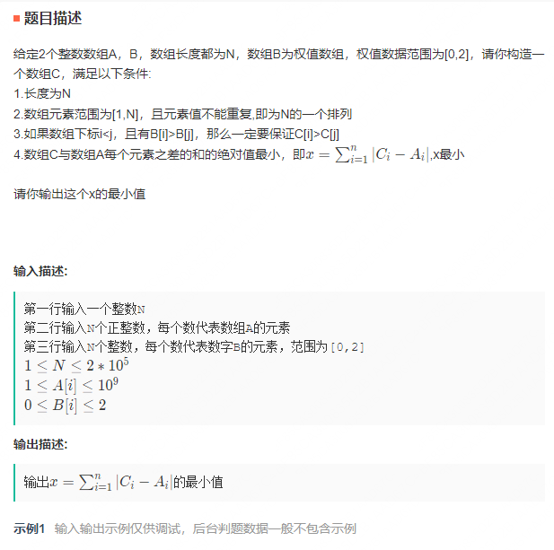
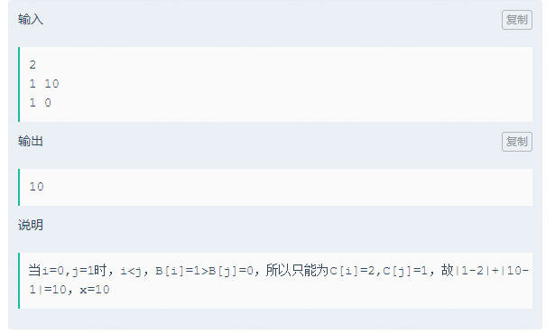
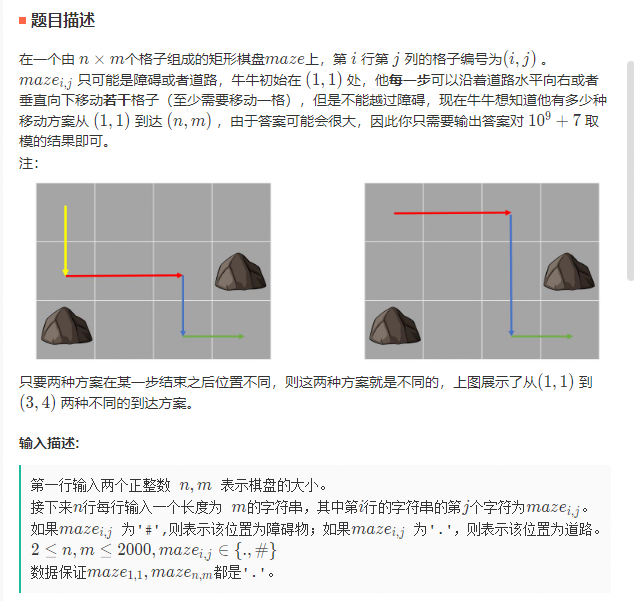

## 腾讯23-03-26客户/移动端方向

5道编程，总结一下做的情况。

### 1. 分组链表

对链表相邻节点分组，分组后相邻组交换，如果分组数为奇数，那么最后一个分组不用交换。例如：1->2->3->4->5 ==> [1, 2] -> [3, 4] -> [5] ==> 3->4->1->2->5

这题虽然过了，但做得很不好，而且花了40多分钟，非常可惜，有必要熟悉一下这种简单题。


### 2. 一道满二叉树的查询问题，比较简单，很快就过了，比较基础。


### 3. 折叠回文子串

给出一个长度为n的字符串，你可以进行字符串的回文子串操作任意次(>=0次)：如abba折叠为ab(向左折叠)或ba(向右折叠)；baaab折叠后可以为baa或aab。
通过执行上述操作可以得到多少种不同的字符串？

```bash
Input:
3       # 字符串长度
aba     # 字符串
Output:
3
# 折叠0次：aba
# 折叠1次：ab、ba

Input:
5
aabaa
Output:
8       # aabaa, abaa, aaba, aba, aab, baa, ab, ba
```

做了很久，但只过了5%，至今没太读懂题目，我当时以为是提取字符串的所有回文子串并折叠一共有多少中不同的字符，现在发现应该不是这样。

### 4. 找最小值
题比较复杂，没时间看，直接贴图：





### 5. 不同路径

感觉是LC原题，所以很快也过了。

